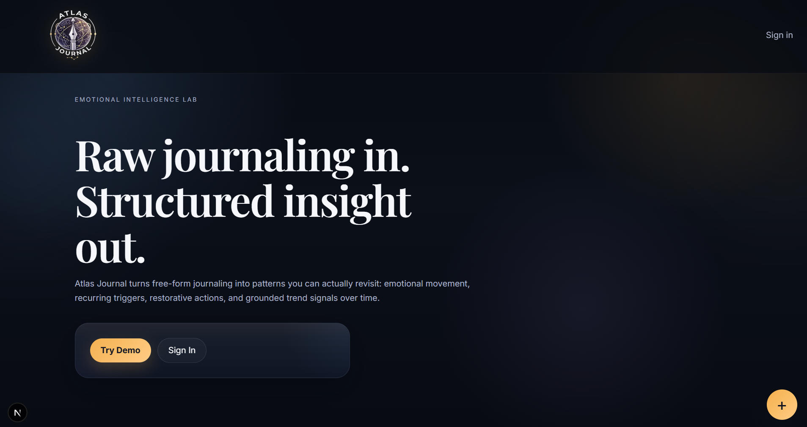
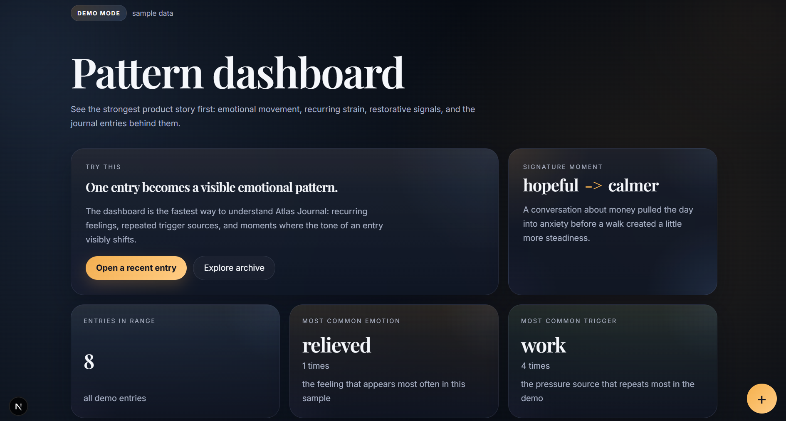
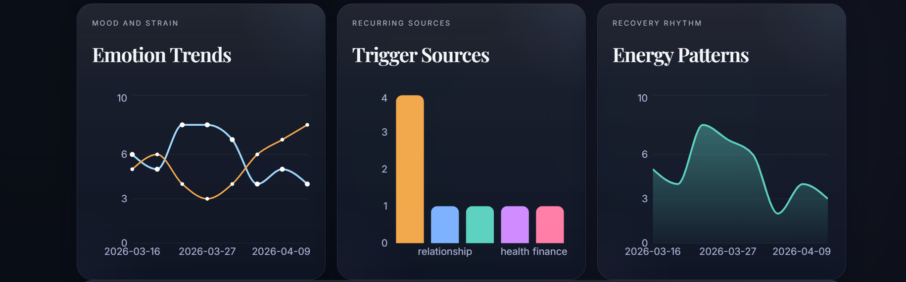
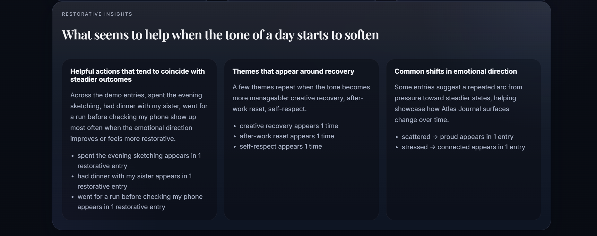
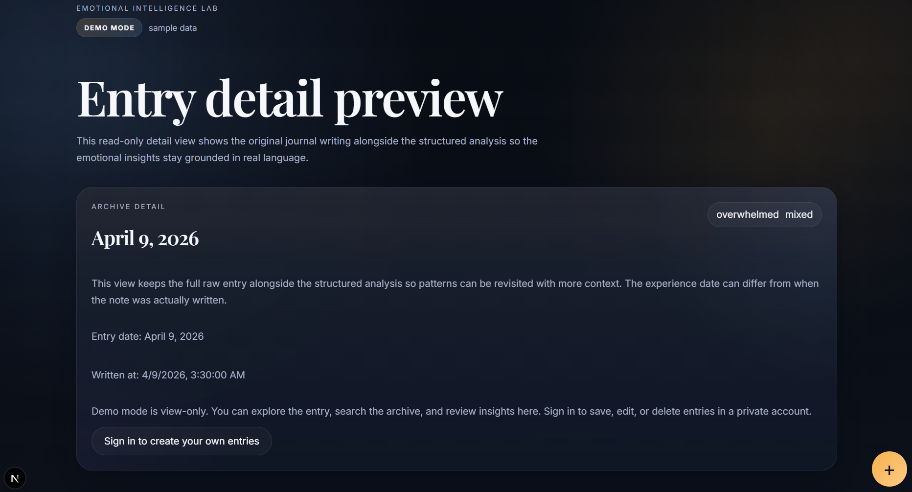
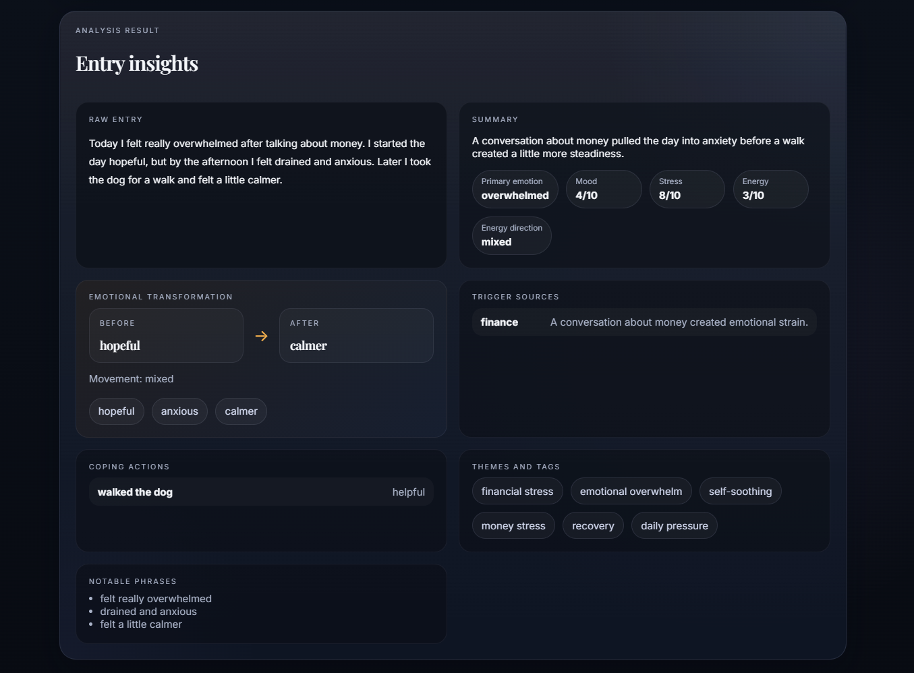
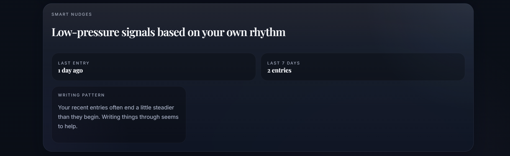
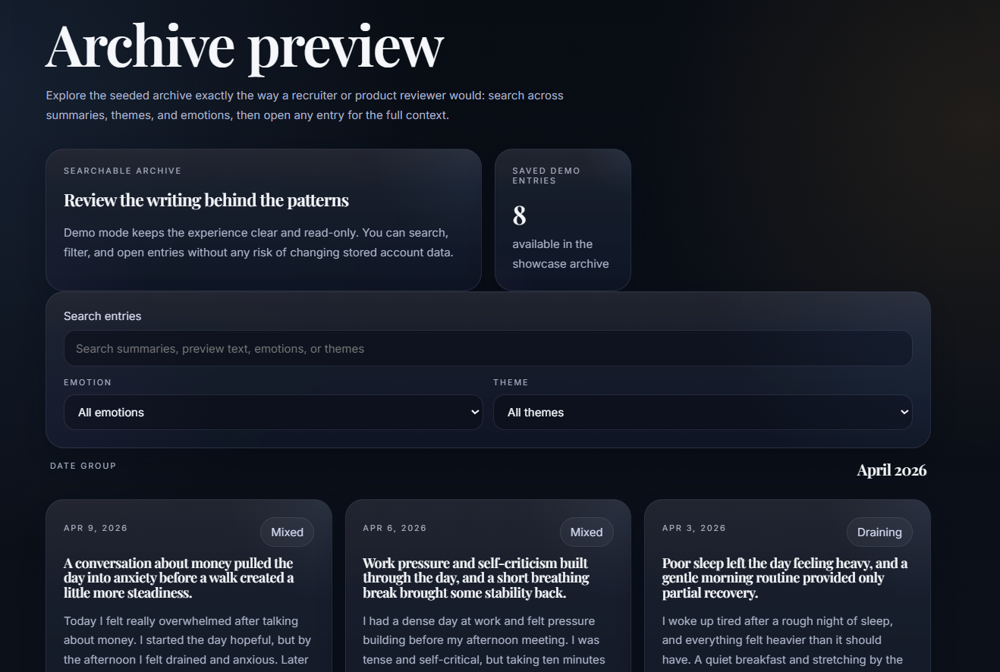
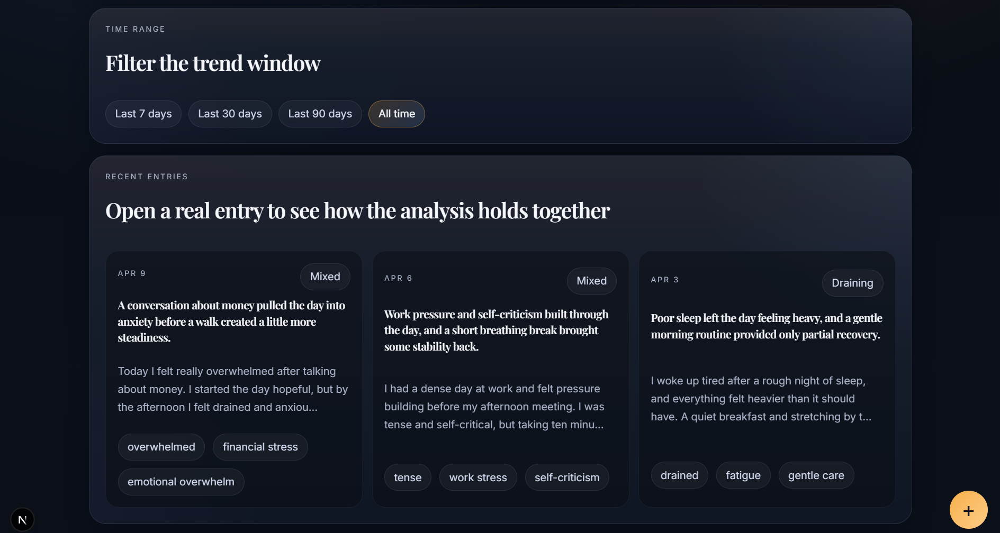
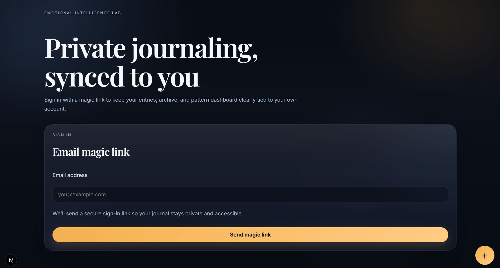

# Atlas Journal

A production-ready emotional intelligence journaling platform with real user auth, AI analysis, and pattern-driven insights.

Atlas Journal transforms raw journaling into structured emotional insight.

Instead of static entries, it surfaces patterns over time — emotional movement, recurring triggers, and restorative signals — so reflection becomes something you can actually revisit and understand.

This project includes:
- A full journaling experience with authenticated user data
- A recruiter-friendly interactive demo mode (no sign-in required)
- A pattern dashboard that highlights emotional trends over time

## Preview

<p align="center">
  
</p>

<p align="center">
  
</p>

<p align="center">
  
</p>

<p align="center">
  
</p>

<p align="center">
  
</p>

<p align="center">
  
</p>

<p align="center">
  
</p>

<p align="center">
  
</p>

<p align="center">
  
</p>

<p align="center">
  
</p>


## 🌐 Live App

👉 [https://atlasjournal.dev](https://atlasjournal.dev)

---

## 🧠 What makes this different

Most journaling apps:

* store entries
* maybe show mood charts

**Atlas Journal:**

* extracts emotional signals from unstructured writing
* identifies patterns over time
* surfaces *behavioral insights*
* reinforces positive habits through personalized nudges

👉 It turns reflection into **actionable self-awareness**

---

## ⚙️ Core capabilities

* ✍️ Free-form journaling (raw input)
* 🧠 AI-powered emotional analysis
* 📊 Trend tracking (emotion, stress, energy)
* 🔍 Search + archive system
* 🧭 Pattern recognition (triggers, coping, themes)
* 💡 Restorative insights (what helps vs. harms)
* 🔁 Behavioral nudges based on user patterns
* 🔐 Secure user authentication (Supabase magic link)
* ☁️ User-scoped cloud data storage (Postgres via Supabase)

---

## 🧩 Data pipeline

```text
Raw Journal Entry
        ↓
AI Extraction Layer
        ↓
Structured Emotional Schema
        ↓
User-Scoped Storage (Supabase)
        ↓
Aggregation + Trend Analysis
        ↓
Insights + Nudges + Dashboard
```

---

## 🧪 Demo Mode

Atlas Journal includes a **demo mode** that allows full exploration without authentication.

* Uses pre-seeded sample entries
* Mirrors real app behavior
* Allows recruiters/users to explore instantly

---

## 📁 Key files

* `lib/schema.ts`
  Zod validation for the structured analysis shape

* `analyzeEntry.prompt.txt`
  Extraction rules used for AI analysis

* `data/demoEntries.json`
  Sample data used for demo mode

---

## 🧱 File structure (simplified)

```text
app/
  api/analyze/route.ts
  archive/
  dashboard/
  journal/
  auth/

components/
  AppFrame.tsx
  ArchiveEntryList.tsx
  DashboardRangeFilter.tsx
  JournalEntryForm.tsx
  ResultsCard.tsx

lib/
  ai.ts
  supabase/
  schema.ts

```

---

## 🔐 Authentication

* Magic link email authentication (Supabase)
* Emails sent via Resend
* Environment-aware redirects (localhost / Vercel / production)

---

## 🚀 Local development

```bash
npm install
npm run dev
```

Then open:

```text
http://localhost:3000
```

---

## ⚠️ Environment variables

You will need:

```text
NEXT_PUBLIC_SUPABASE_URL=
NEXT_PUBLIC_SUPABASE_ANON_KEY=
RESEND_API_KEY=
NEXT_PUBLIC_SITE_URL=
```

---

## 🛠 Tech Stack

Next.js · TypeScript · Supabase · Postgres · Tailwind CSS · Resend

---

## ✨ Notes

* All analysis is validated with Zod before saving
* Each user’s data is isolated and secure
* Demo mode is fully separate from real user data
* Designed as a production-ready MVP with clear extension paths
